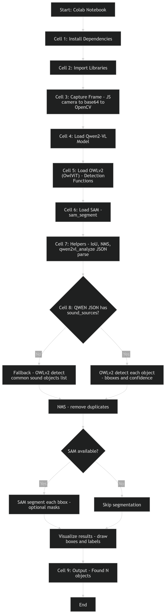

# AI-Powered-Sound-Capable-Object-Detection-System-Qwen2-VL-OWLv2-SAM-
A vision language powered detection pipeline that analyzes images to identify and localize objects capable of producing sound. The system integrates Qwen2-VL for semantic scene reasoning, OWLv2 for text-guided object detection, and SAM for precise segmentation.

## System Workflow

  

